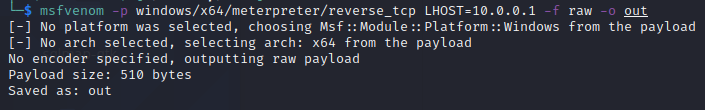
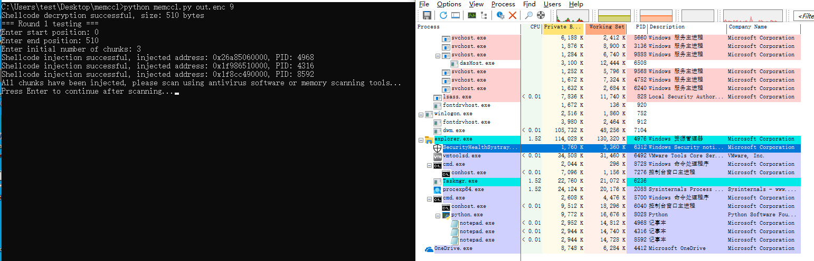
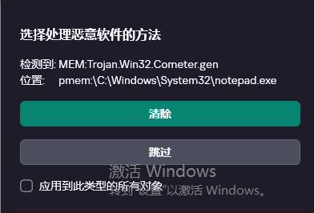
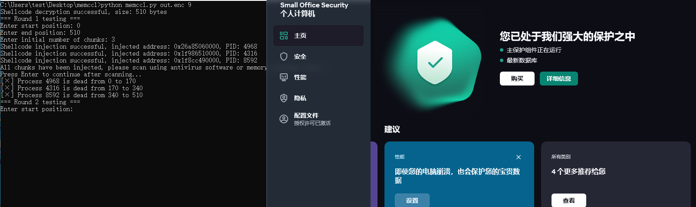
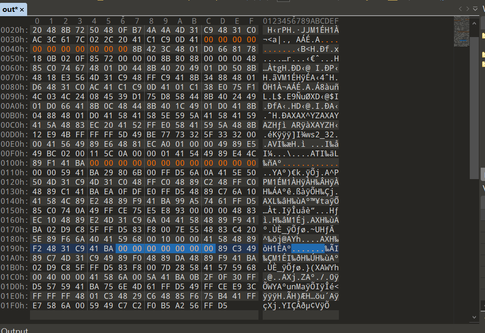
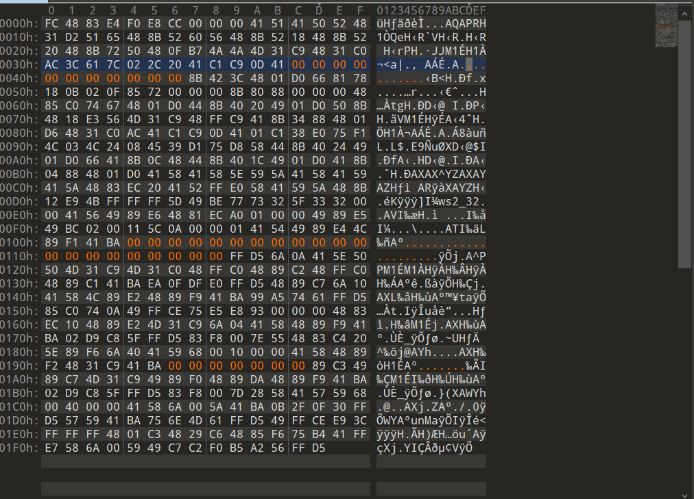

# Memccl

定位内存特征码的工具，原理就是把shellcode分段置0注入到可信进程中给杀毒软件内存扫描，以此缩小特征码范围。

## 依赖

`pip install psutil`

## 使用方法和原理

首先使用enc.py给shellcode单字节加密，防止静态被杀

`usage: python enc.py <shellcode.bin> <key>`

然后用同一个key解密和注入shellcode

`Usage: python memccl.py <encrypted_shellcode.enc> <key>`

输入需要置为0的范围和分段，然后就会把shellcode注入进notepad.exe中，然后开杀毒软件的扫描功能把有问题的shellcode杀掉，多来几次就能定位到特征码大致方位。

## 例子

**！！！简单样例，不够精细，仅作参考！！！**

使用卡巴斯基最新版和msf原版shellcode测试




### 测试

首先不分割shellcode，使用`python enc.py out 9`做简单加密防止静态被删，然后把out.enc使用memccl打开：


然后使用卡巴斯基扫描，可以看到已经扫描出来了，然后在卡巴斯基中把他们全部解决掉:

全部选择清除：


清除完之后，卡巴回到安全状态，然后回去按回车：


这里发现全被杀了，那就使用split.py分割一下文件一块一块看，使用`python split_bin.py out 3`分割开，然后取第一段加密，重复上面的操作:

```
python memccl.py out.part1.0-170.enc 9
Shellcode decryption successful, size: 170 bytes
=== Round 1 testing ===
Enter start position: 0
Enter end position: 170
Enter initial number of chunks: 2
Shellcode injection successful, injected address: 0x24f1eac0000, PID: 8944
Shellcode injection successful, injected address: 0x2a4d7cc0000, PID: 8464
All chunks have been injected, please scan using antivirus software or memory scanning tools...
Press Enter to continue after scanning...
[√] Process 8944 is alive from 0 to 85
[×] Process 8464 is dead from 85 to 170
=== Round 2 testing ===
Enter start position: 0
Enter end position: 85
Enter initial number of chunks: 3
Shellcode injection successful, injected address: 0x1dabc4b0000, PID: 2744
Shellcode injection successful, injected address: 0x2448b780000, PID: 4648
Shellcode injection successful, injected address: 0x1de9ea00000, PID: 3340
All chunks have been injected, please scan using antivirus software or memory scanning tools...
Press Enter to continue after scanning...
[×] Process 2744 is dead from 0 to 28
[√] Process 4648 is alive from 28 to 56
[√] Process 3340 is alive from 56 to 84
=== Round 3 testing ===
Enter start position: 28
Enter end position: 84
Enter initial number of chunks: 1
Shellcode injection successful, injected address: 0x26e78ca0000, PID: 2164
All chunks have been injected, please scan using antivirus software or memory scanning tools...
Press Enter to continue after scanning...
[√] Process 2164 is alive from 28 to 84
=== Round 4 testing ===
Enter start position: 40
Enter end position: 80
Enter initial number of chunks: 1
Shellcode injection successful, injected address: 0x2102dd00000, PID: 5644
All chunks have been injected, please scan using antivirus software or memory scanning tools...
Press Enter to continue after scanning...
[√] Process 5644 is alive from 40 to 80
=== Round 5 testing ===
Enter start position: 50
Enter end position: 80
Enter initial number of chunks: 1
Shellcode injection successful, injected address: 0x23f7d490000, PID: 3656
All chunks have been injected, please scan using antivirus software or memory scanning tools...
Press Enter to continue after scanning...
[√] Process 3656 is alive from 50 to 80
=== Round 6 testing ===
Enter start position: 70
Enter end position: 80
Enter initial number of chunks: 1
Shellcode injection successful, injected address: 0x20261480000, PID: 4376
All chunks have been injected, please scan using antivirus software or memory scanning tools...
Press Enter to continue after scanning...
[×] Process 4376 is dead from 70 to 80
=== Round 7 testing ===
Enter start position: 60
Enter end position: 70
Enter initial number of chunks: 1
Shellcode injection successful, injected address: 0x2167b8c0000, PID: 9696
All chunks have been injected, please scan using antivirus software or memory scanning tools...
Press Enter to continue after scanning...
[√] Process 9696 is alive from 60 to 70
```

到此，可以判断特征码在60-70附近，因为把60-70置零之后，卡巴斯基不爆毒了。按照这种思路处理第二段和第三段：

```
python memccl.py out.part2.170-340.enc 9
Shellcode decryption successful, size: 170 bytes
=== Round 1 testing ===
Enter start position: 0
Enter end position: 170
Enter initial number of chunks: 3
Shellcode injection successful, injected address: 0x24a90cf0000, PID: 9336
Shellcode injection successful, injected address: 0x20c06ee0000, PID: 6500
Shellcode injection successful, injected address: 0x1a1fde00000, PID: 3820
All chunks have been injected, please scan using antivirus software or memory scanning tools...
Press Enter to continue after scanning...
[×] Process 9336 is dead from 0 to 56
[√] Process 6500 is alive from 56 to 112
[√] Process 3820 is alive from 112 to 168
=== Round 2 testing ===
Enter start position: 56
Enter end position: 168
Enter initial number of chunks: 3
Shellcode injection successful, injected address: 0x206996c0000, PID: 7784
Shellcode injection successful, injected address: 0x2cff8160000, PID: 1800
Shellcode injection successful, injected address: 0x2cf0b940000, PID: 5516
All chunks have been injected, please scan using antivirus software or memory scanning tools...
Press Enter to continue after scanning...
[√] Process 7784 is alive from 56 to 93
[√] Process 1800 is alive from 93 to 130
[√] Process 5516 is alive from 130 to 167
=== Round 3 testing ===
Enter start position: 56
Enter end position: 168
Enter initial number of chunks: 2
Shellcode injection successful, injected address: 0x28691650000, PID: 7212
Shellcode injection successful, injected address: 0x26e94990000, PID: 2056
All chunks have been injected, please scan using antivirus software or memory scanning tools...
Press Enter to continue after scanning...
[√] Process 7212 is alive from 56 to 112
[√] Process 2056 is alive from 112 to 168
=== Round 4 testing ===
Enter start position: 80
Enter end position: 160
Enter initial number of chunks: 1
Shellcode injection successful, injected address: 0x20fa1a60000, PID: 4088
All chunks have been injected, please scan using antivirus software or memory scanning tools...
Press Enter to continue after scanning...
[√] Process 4088 is alive from 80 to 160
=== Round 5 testing ===
Enter start position: 100
Enter end position: 160
Enter initial number of chunks: 1
Shellcode injection successful, injected address: 0x1d093a80000, PID: 7160
All chunks have been injected, please scan using antivirus software or memory scanning tools...
Press Enter to continue after scanning...
[√] Process 7160 is alive from 100 to 160
=== Round 6 testing ===
Enter start position: 150
Enter end position: 160
Enter initial number of chunks: 1
Shellcode injection successful, injected address: 0x22601010000, PID: 4436
All chunks have been injected, please scan using antivirus software or memory scanning tools...
Press Enter to continue after scanning...56
[×] Process 4436 is dead from 150 to 160
=== Round 7 testing ===
Enter start position: 56
Enter end position: 168
Enter initial number of chunks: 6
Shellcode injection successful, injected address: 0x19e36750000, PID: 4304
Shellcode injection successful, injected address: 0x2b341960000, PID: 2968
Shellcode injection successful, injected address: 0x17271810000, PID: 4400
Shellcode injection successful, injected address: 0x14dcf570000, PID: 9712
Shellcode injection successful, injected address: 0x205699d0000, PID: 9156
Shellcode injection successful, injected address: 0x1c8fc970000, PID: 2464
All chunks have been injected, please scan using antivirus software or memory scanning tools...
Press Enter to continue after scanning...
[×] Process 4304 is dead from 56 to 74
[√] Process 2968 is alive from 74 to 92
[√] Process 4400 is alive from 92 to 110
[×] Process 9712 is dead from 110 to 128
[√] Process 9156 is alive from 128 to 146
[√] Process 2464 is alive from 146 to 164
=== Round 8 testing ===
Enter start position: 74
Enter end position: 110
Enter initial number of chunks: 4
Shellcode injection successful, injected address: 0x1ea41bd0000, PID: 6308
Shellcode injection successful, injected address: 0x211881b0000, PID: 1308
Shellcode injection successful, injected address: 0x143352a0000, PID: 9896
Shellcode injection successful, injected address: 0x2150ab40000, PID: 5324
All chunks have been injected, please scan using antivirus software or memory scanning tools...
Press Enter to continue after scanning...
[×] Process 6308 is dead from 74 to 83
[√] Process 1308 is alive from 83 to 92
[√] Process 9896 is alive from 92 to 101
[√] Process 5324 is alive from 101 to 110
=== Round 9 testing ===
Enter start position: 90
Enter end position: 101
Enter initial number of chunks: 1
Shellcode injection successful, injected address: 0x1cccc620000, PID: 8540
All chunks have been injected, please scan using antivirus software or memory scanning tools...
Press Enter to continue after scanning...
[√] Process 8540 is alive from 90 to 101
=== Round 10 testing ===
Enter start position:
```

上面的round7可以看到，前后都能过的情况就说明该规则需满足多个条件，后续测试可以测试到其中一个特征码大约在90-101附近，接着是处理第三段：

```
python memccl.py out.part3.340-510.enc 9
Shellcode decryption successful, size: 170 bytes
=== Round 1 testing ===
Enter start position: 0
Enter end position: 170
Enter initial number of chunks: 5
Shellcode injection successful, injected address: 0x19a76530000, PID: 1624
Shellcode injection successful, injected address: 0x1ad59080000, PID: 10800
Shellcode injection successful, injected address: 0x1cc47a40000, PID: 10316
Shellcode injection successful, injected address: 0x17f46420000, PID: 8388
Shellcode injection successful, injected address: 0x1fb22b70000, PID: 10928
All chunks have been injected, please scan using antivirus software or memory scanning tools...
Press Enter to continue after scanning...
[×] Process 1624 is dead from 0 to 34
[√] Process 10800 is alive from 34 to 68
[√] Process 10316 is alive from 68 to 102
[√] Process 8388 is alive from 102 to 136
[×] Process 10928 is dead from 136 to 170
=== Round 2 testing ===
Enter start position: 40
Enter end position: 60
Enter initial number of chunks: 1
Shellcode injection successful, injected address: 0x1ac7e100000, PID: 3272
All chunks have been injected, please scan using antivirus software or memory scanning tools...
Press Enter to continue after scanning...
[×] Process 3272 is dead from 40 to 60
=== Round 3 testing ===
Enter start position: 34
Enter end position: 136
Enter initial number of chunks: 5
Shellcode injection successful, injected address: 0x2b1da010000, PID: 3360
Shellcode injection successful, injected address: 0x1eb19860000, PID: 3164
Shellcode injection successful, injected address: 0x2482e910000, PID: 3800
Shellcode injection successful, injected address: 0x25758850000, PID: 8496
Shellcode injection successful, injected address: 0x1a6b15b0000, PID: 10880
All chunks have been injected, please scan using antivirus software or memory scanning tools...
Press Enter to continue after scanning...
[×] Process 3360 is dead from 34 to 54
[√] Process 3164 is alive from 54 to 74
[×] Process 3800 is dead from 74 to 94
[×] Process 8496 is dead from 94 to 114
[√] Process 10880 is alive from 114 to 134
=== Round 4 testing ===
Enter start position: 54
Enter end position: 74
Enter initial number of chunks: 3
Shellcode injection successful, injected address: 0x1bc77e60000, PID: 5936
Shellcode injection successful, injected address: 0x22191a90000, PID: 5128
Shellcode injection successful, injected address: 0x28042f30000, PID: 9364
All chunks have been injected, please scan using antivirus software or memory scanning tools...
Press Enter to continue after scanning...
[×] Process 5936 is dead from 54 to 60
[×] Process 5128 is dead from 60 to 66
[√] Process 9364 is alive from 66 to 72
=== Round 5 testing ===
Enter start position:
```

确定出一段特征码大约在66-72附近，接下来计算出特征码在原文件中的偏移为60-70，260-271，406-412，手动编辑一下置零测试：


然后再加密，再扫描，再到扫描的时候发现已经少了很多了：

```
python memccl.py out-1.enc 9
Shellcode decryption successful, size: 510 bytes
=== Round 1 testing ===
Enter start position: 0
Enter end position: 510
Enter initial number of chunks: 5
Shellcode injection successful, injected address: 0x22b4f760000, PID: 7176
Shellcode injection successful, injected address: 0x199772e0000, PID: 2864
Shellcode injection successful, injected address: 0x2644acb0000, PID: 6736
Shellcode injection successful, injected address: 0x1d4080b0000, PID: 9452
Shellcode injection successful, injected address: 0x206a8d60000, PID: 8344
All chunks have been injected, please scan using antivirus software or memory scanning tools...
Press Enter to continue after scanning...
[×] Process 7176 is dead from 0 to 102
[×] Process 2864 is dead from 102 to 204
[√] Process 6736 is alive from 204 to 306
[√] Process 9452 is alive from 306 to 408
[×] Process 8344 is dead from 408 to 510
```

然后跑完：

```
python memccl.py out-1.enc 9
Shellcode decryption successful, size: 510 bytes
=== Round 1 testing ===
Enter start position: 0
Enter end position: 510
Enter initial number of chunks: 5
Shellcode injection successful, injected address: 0x22b4f760000, PID: 7176
Shellcode injection successful, injected address: 0x199772e0000, PID: 2864
Shellcode injection successful, injected address: 0x2644acb0000, PID: 6736
Shellcode injection successful, injected address: 0x1d4080b0000, PID: 9452
Shellcode injection successful, injected address: 0x206a8d60000, PID: 8344
All chunks have been injected, please scan using antivirus software or memory scanning tools...
Press Enter to continue after scanning...
[×] Process 7176 is dead from 0 to 102
[×] Process 2864 is dead from 102 to 204
[√] Process 6736 is alive from 204 to 306
[√] Process 9452 is alive from 306 to 408
[×] Process 8344 is dead from 408 to 510
=== Round 2 testing ===
Enter start position: 204
Enter end position: 408
Enter initial number of chunks: 5
Shellcode injection successful, injected address: 0x20226cd0000, PID: 11072
Shellcode injection successful, injected address: 0x1f7d7790000, PID: 10796
Shellcode injection successful, injected address: 0x1de86140000, PID: 9768
Shellcode injection successful, injected address: 0x20e84f90000, PID: 9880
Shellcode injection successful, injected address: 0x1a60bd50000, PID: 4880
All chunks have been injected, please scan using antivirus software or memory scanning tools...
Press Enter to continue after scanning...
[×] Process 11072 is dead from 204 to 244
[√] Process 10796 is alive from 244 to 284
[√] Process 9768 is alive from 284 to 324
[√] Process 9880 is alive from 324 to 364
[×] Process 4880 is dead from 364 to 404
=== Round 3 testing ===
Enter start position: 244
Enter end position: 364
Enter initial number of chunks: 5
Shellcode injection successful, injected address: 0x20a61ab0000, PID: 8740
Shellcode injection successful, injected address: 0x25c92090000, PID: 5112
Shellcode injection successful, injected address: 0x24592060000, PID: 5592
Shellcode injection successful, injected address: 0x23604ef0000, PID: 3312
Shellcode injection successful, injected address: 0x1c5e56f0000, PID: 9764
All chunks have been injected, please scan using antivirus software or memory scanning tools...
Press Enter to continue after scanning...
[×] Process 8740 is dead from 244 to 268
[√] Process 5112 is alive from 268 to 292
[√] Process 5592 is alive from 292 to 316
[√] Process 3312 is alive from 316 to 340
[×] Process 9764 is dead from 340 to 364
=== Round 4 testing ===
Enter start position: 268
Enter end position: 340
Enter initial number of chunks: 5
Shellcode injection successful, injected address: 0x24cf5490000, PID: 8548
Shellcode injection successful, injected address: 0x1ad88c50000, PID: 3348
Shellcode injection successful, injected address: 0x233f89a0000, PID: 6180
Shellcode injection successful, injected address: 0x16413380000, PID: 8876
Shellcode injection successful, injected address: 0x1a439cc0000, PID: 5944
All chunks have been injected, please scan using antivirus software or memory scanning tools...
Press Enter to continue after scanning...
[√] Process 8548 is alive from 268 to 282
[×] Process 3348 is dead from 282 to 296
[√] Process 6180 is alive from 296 to 310
[√] Process 8876 is alive from 310 to 324
[√] Process 5944 is alive from 324 to 338
=== Round 5 testing ===
Enter start position: 272
Enter end position: 275
Enter initial number of chunks: 1
Shellcode injection successful, injected address: 0x1aa9ce40000, PID: 7956
All chunks have been injected, please scan using antivirus software or memory scanning tools...
Press Enter to continue after scanning...
[×] Process 7956 is dead from 272 to 275
=== Round 6 testing ===
Enter start position: 272
Enter end position: 280
Enter initial number of chunks: 1
Shellcode injection successful, injected address: 0x254089b0000, PID: 11092
All chunks have been injected, please scan using antivirus software or memory scanning tools...
Press Enter to continue after scanning...
[√] Process 11092 is alive from 272 to 280
=== Round 7 testing ===
Enter start position:
```

可以看到还有一个特征处于272-280附近，最终总结为部分特征处于下列位置附近：

